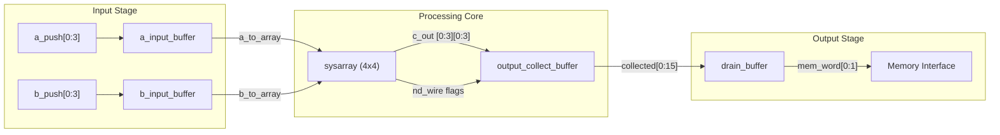

# Systolic Array - 4x4 Matrix Multiplier

A hardware implementation of a 4x4 systolic array for efficient matrix multiplication using 8-bit integer inputs and 32-bit accumulated outputs. [1](#0-0) 

## Features

- **4x4 Processing Element Grid**: Parallel MAC (Multiply-Accumulate) operations
- **Input Skewing**: Automatic temporal alignment of input data using conveyor belt buffers
- **Synchronous Pipeline**: Clock-driven data flow with reset capability
- **Memory Interface**: Outputs 2 words per cycle to external memory
- **Control Signals**: New data flags track computation boundaries for result latching

## Architecture Overview

The system consists of four main stages operating as a synchronous pipeline: [2](#0-1) 

1. **Input Buffering & Skewing**: Operands A and B are delayed through shift registers of varying lengths (8-11 cycles) to ensure proper wavefront alignment
2. **Systolic Computation**: Data propagates through the 4x4 PE grid with row-wise data moving left-to-right and column-wise data moving top-to-bottom
3. **Result Latching**: PE outputs are captured when control signals coincide
4. **Collection & Drain**: Results are aggregated and serialized to the memory interface



## Module Descriptions

### `sysarray`
The core processing module implementing a 4x4 grid of Processing Elements (PEs). [3](#0-2) 

- **Inputs**: 8-bit operands A[0:3] and B[0:3], new_data control flags
- **Outputs**: 32-bit accumulated results C[0:3][0:3], propagated control wires
- **Function**: Instantiates PEs in a 2D grid using generate loops, with horizontal data flow for A and vertical flow for B

### `a_input_buffer` / `b_input_buffer`
Input skewing buffers implemented as conveyor belt shift registers. [4](#0-3) 

- **Belt Lengths**: Row 0/Col 0 = 8 cycles, incrementing by 1 for each subsequent row/column (8, 9, 10, 11)
- **Dual Belts**: Parallel 1-bit new_data flags travel alongside 8-bit data
- **Purpose**: Ensures temporal alignment so that A[i] meets B[j] at PE[i,j] at the correct time

### `output_collect_buffer`
Monitors all PEs and aggregates computation results. [5](#0-4) 

- **Trigger**: Captures results when both a_new_data_wire and b_new_data_wire are high at a PE
- **Capacity**: Stores 16 x 32-bit results
- **Output**: Pulses collect_done when all results are gathered

### `drain_buffer`
Serializes collected results for memory interface. [6](#0-5) 

- **Throughput**: Outputs 2 words per clock cycle
- **Operation**: State machine that loads 16 words and drains them sequentially
- **Completion**: Signals drain_done when all data is transmitted

### `top`
Top-level wrapper connecting all modules. [7](#0-6) 

- **Interface**: Memory controller inputs (a_push, b_push, control flags) and memory write outputs
- **Integration**: Connects input buffers → sysarray → output_collect_buffer → drain_buffer

## Data Flow Summary

| Signal Name | Width | Direction | Description |
|-------------|-------|-----------|-------------|
| `a_to_array` | 4 x 8-bit | a_buf → sa | Skewed row operands |
| `a_nd_to_array` | 4 x 1-bit | a_buf → sa | Skewed row control flags |
| `c_out` | 16 x 32-bit | sa → ocb | Final accumulated products |
| `collected` | 16 x 32-bit | ocb → db | Flattened result array |
| `mem_word` | 2 x 32-bit | db → Ext | Memory write data |

## File Structure

```
.
├── array.v      # sysarray and top modules
└── buffers.v    # input buffers, output collection, and drain buffer
```

## Notes

- This README is based on the available source files (`array.v` and `buffers.v`). Information about build instructions, testbenches, simulation scripts, or usage examples was not found in the provided context. [8](#0-7) [9](#0-8) 
- The individual Processing Element (`pe`) module is referenced but its implementation was not available in the context provided.

Wiki pages you might want to explore:
- [System Architecture (rithikreddypalla/systolic-array)](/wiki/rithikreddypalla/systolic-array#1.2)
